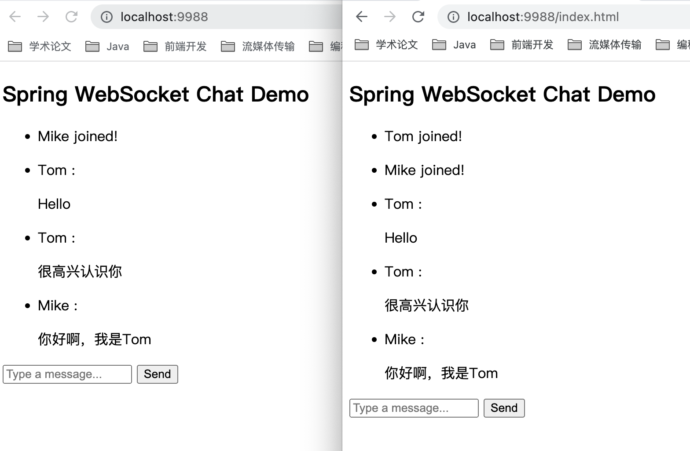
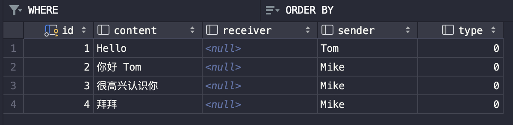
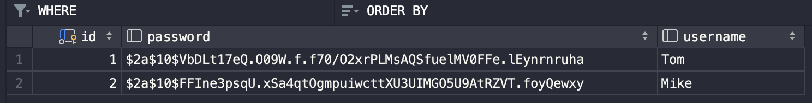
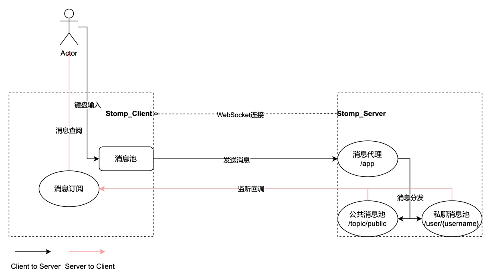
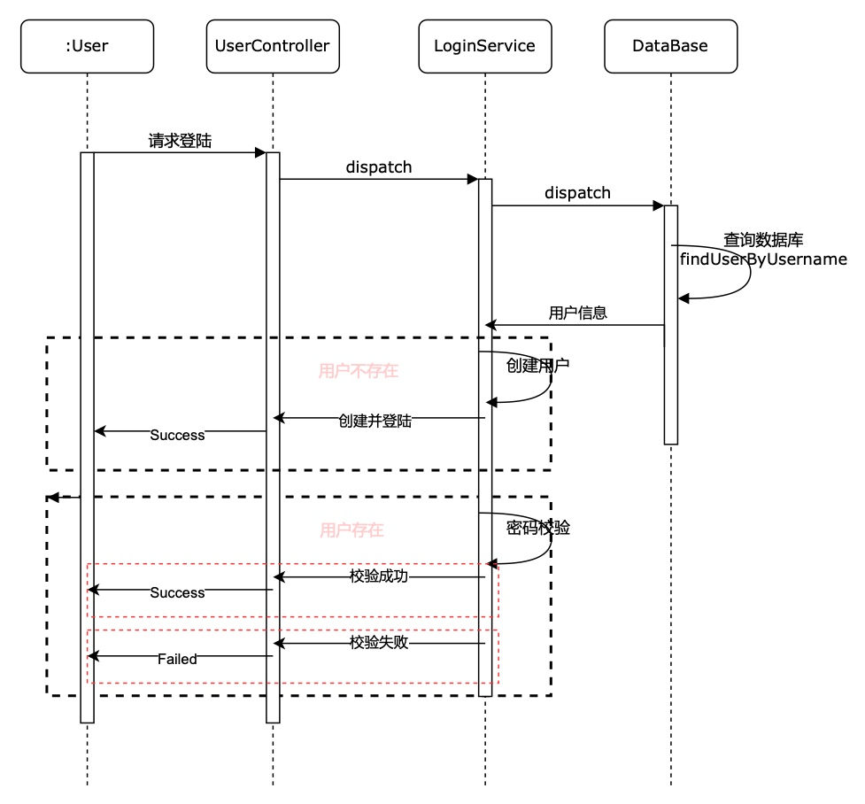
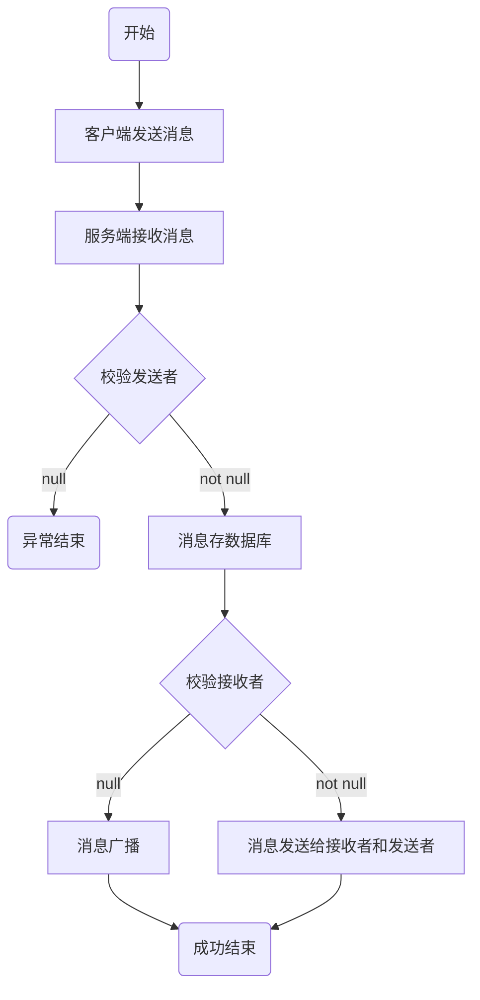
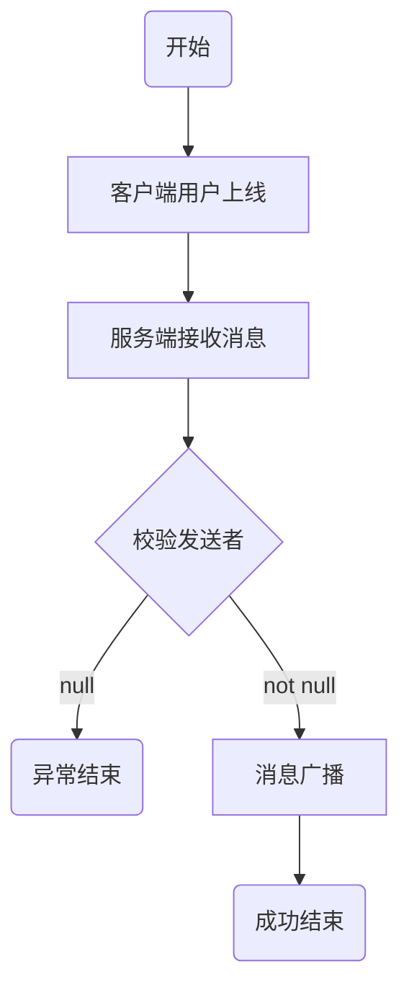
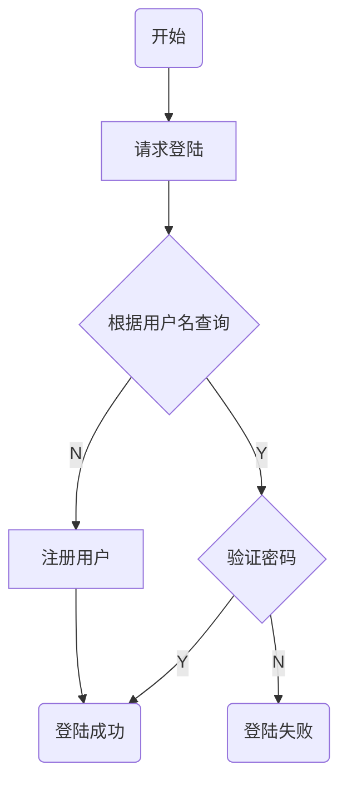

# 基于STOMP协议的聊天服务

## 前言

本项目是作者在学习SpringBoot之后实现的简单项目，适合初初初学者（学习时间小于等于一个月）。

在启动项目前，需要先配置好MySQL数据库。

## 项目介绍

一个简单的机遇Stomp协议的网页端聊天项目，项目涉及到以下知识内容：

- SpringBoot3.x
- Spring Security 6.x
- Spring Data Jpa
- MySQL

实现功能：

- 群聊
- 私聊
- 上线提醒
- 下线提醒

**效果展示：**







待完善...

- [ ] 记录历史消息（聊天记录）
- [ ]  WebSocket鉴权
- [ ] 异常消息处理，数据校验


## 项目整体结构



整体的逻辑如上图所示，逻辑上包括以下几个部分

- Stomp客户端与Stomp服务端使用WebSocket进行连接
- 用户订阅服务端相关消息池
- 用户发送数据给服务端消息代理
- 服务端消息代理分发消息到消息池
- 客户端订阅的消息池一旦有新消息，回调函数更新最新消息

---

**服务端配置**

配置Stomp服务器，设置

- 消息代理
- 公共消息池
- 私聊消息池（URL参数username）

```Java
/**
* 建立Stomp服务器，监听来自客户端的连接
* 建立消息代理，url前缀为'/app'
* 注册消息池，url前缀分别为'/topic'和'/user'，分别代表广播和私聊
*/
@Configuration
@EnableWebSocketMessageBroker
public class WebSocketConfig implements WebSocketMessageBrokerConfigurer {

    @Override
    public void registerStompEndpoints(StompEndpointRegistry registry) {
        // 将'/ws'注册为一个STOMP端点，与客户端建立连接
        registry.addEndpoint("/ws").withSockJS();
    }

    @Override
    public void configureMessageBroker(MessageBrokerRegistry registry) {
        // 注册消息代理前缀
        registry.setApplicationDestinationPrefixes("/app");
        // 注册消息池前缀
        registry.enableSimpleBroker("/topic", "/user");
    }

}
```

**客户端配置**

在HTML页面中引入WebSocket和Stomo依赖

```html
<script src="https://cdnjs.cloudflare.com/ajax/libs/sockjs-client/1.1.4/sockjs.min.js"></script>
<script src="https://cdnjs.cloudflare.com/ajax/libs/stomp.js/2.3.3/stomp.min.js"></script>
```

创建Stomp客户端程序，与Stomp服务端建立WebSocket连接，并使用Stomp封装该连接

```js
var socket = new SockJS('./ws');
var stompClient = Stomp.over(socket);
```

---

**服务端数据传输逻辑**

在Controller中使用@MessageMapping注解对客户端发送的消息进行处理

```java
/**
* 接收来自客户端发送的信息，发送端指定URL='/app/chat.sendMessage'
* 转发到消息到 '/topic/public' ，所有订阅了 '/topic/public' 的客户均可以接收到广播消息
* 转发到指定的receiver
* 关于数据实体，之后内容会讨论
*/
private final SimpMessagingTemplate messagingTemplate;
private final ChatMessageRepository chatMessageRepository;
@MessageMapping("/chat.sendMessage")
public void sendMessage(@Payload ChatMessage chatMessage) {
		if (chatMessage.getType() == ChatMessage.MessageType.CHAT) {
				chatMessageRepository.save(chatMessage);
		}
    if (chatMessage.getReceiver() == null) {
        messagingTemplate.convertAndSend("/topic/public", chatMessage);
    } else {
        // 发送方和接收方都要收到消息回显
    		messagingTemplate.convertAndSendToUser(chatMessage.getSender(), "notification", chatMessage);
        messagingTemplate.convertAndSendToUser(chatMessage.getReceiver(), "notification", chatMessage);
    }
}
```

**客户端数据传输逻辑**

接收消息

```js
/** 
* stompClient.subscribe(destUrl, func);
* 订阅消息池'/toplic/public' 
* 当消息池中有新消息时，会触发回调函数onMessageReceived，在该函数中写方法体实现前端数据回显
*/
stompClient.subscribe('/toplic/public', onMessageReceived);

```

发送消息

```js
/**
* stompClient.send(destUrl, {}, data)
* 发送消息到/app/chat.addUser消息池，消息体为用户名
*/
stompClient.send("/app/chat.addUser",
		{},
    JSON.stringify({sender: username, type: 'JOIN'})
)
```

以上只是简单介绍，详细的内容可以参考[Stomp的文档](http://jmesnil.net/stomp-websocket/doc/)。

---

## 业务逻辑

**数据实体**

简单定义两个实体User和ChatMessage，分别用来标识用户信息和聊天记录，id作为自增主键，无实际含义。

```java
// User.java
public class User {
    @Id @GeneratedValue
    private Long id;
    private String username;
    private String password;

    public User() {}
    public User(String username, String password) {
        this.username = username;
        this.password = password;
    }
}
```

```java
// ChatMessage.java
public class ChatMessage {
    @Id @GeneratedValue
    private Long id;
    private String sender;
    private String receiver;
    private String content;
    private MessageType type;

    public ChatMessage() {}
    public ChatMessage(String sender, String receiver, String content) {
        this.sender = sender;
        this.receiver = receiver;
        this.content = content;
    }
    public enum MessageType {
        /**
         * 聊天
         */
        CHAT,
        /**
         * 上线
         */
        JOIN,
        /**
         * 离开
         */
        LEAVE
    }
}
```

实现的功能有：

- 聊天
  - 广播消息给所有在线用户
  - 向指定用户发送消息

- 提醒
  - 用户上线
    - 消息广播
    - 查询该用户聊天记录
  - 用户下线
    - 消息广播

由上述业务分析，需要实现以下数据存储和访问

- 保存聊天记录
- 查询与用户相关的聊天记录

上述数据库实体实现JpaRepository。

```java
// ChatMessageRepository.java
public interface ChatMessageRepository extends JpaRepository<ChatMessage, Long> {
   /**
    * 根据用户名获取聊天记录
    * @param sender: 消息发送者
    * @param receiver: 消息接收者
    * @return 多条信息的列表
    */
   List<ChatMessage> findChatMessagesBySenderOrReceiver(String sender, String receiver);
}
```

需要提醒的是，在查询聊天记录时，若receiver为null，则该记录也应该被查询，因为这是一条广播消息

```java
// UserRepository.java
public interface UserRepository extends JpaRepository<User, Long> {
   /**
    * 根据用户名查找用户
    * @param username 用户名
    * @return 指定的用户
    */
   Optional<User> findUserByUsername(String username);
}
```

**详细设计**

**用户登陆&注册**



---

**服务端聊天消息处理**



**用户上线提醒**



**用户下线提醒**

在建立WebSocket连接时，对于客户端消息头添加字段**username**

服务端添加对WebSocket连接的事件监听，当WebSocket断开链接事件发生时，查看连接头中的**username**，确定下线用户名，然后广播用户的下线消息。

## 安全鉴权

在服务端业务逻辑中，与前端进行数据交互，包括http请求和WebSocket，为了保证服务器只与我们设计的客户端程序进行通信，需要进行安全保护，主要就是

http鉴权（Spring Security 6.x）

```Java
    public SecurityFilterChain filterChain(HttpSecurity http) throws Exception {
        http
                // 开启登陆配置
                .authorizeHttpRequests()
                // 对于登陆和js资源放行
                .requestMatchers("/api/users", "/js/**").permitAll()
                // 表示所有接口，登陆之后就能访问
                .anyRequest().authenticated().and()
                .formLogin()
                .loginPage("/index.html")
                // 登陆处理接口
                .loginProcessingUrl("/login")
                // 定义登陆时，用户名的key，默认为username
                .usernameParameter("username")
                // 定义登陆时，用户密码的key，默认为password
                .passwordParameter("password")
                // 登陆成功处理器
                .successHandler((request, response, authentication) -> {
                    response.setContentType("application/json;charset=utf-8");
                    PrintWriter out = response.getWriter();
                    out.write(mapper.writeValueAsString(Response.ok()));
                    out.flush();
                })
                // 登陆失败的处理器
                .failureHandler((request, response, authentication) -> {
                    response.setContentType("application/json;charset=utf-8");
                    PrintWriter out = response.getWriter();
                    out.write(mapper.writeValueAsString(Response.failed("登陆失败" + this.getClass().getName())));
                    out.flush();
                })
                // 和表单相关的接口可以不受限制直接登陆
                .permitAll().and()
                .logout()
                .logoutUrl("/logout")
                // 登出成功的处理程序
                .logoutSuccessHandler(((request, response, authentication) -> {
                    response.setContentType("application/json;charset=utf-8");
                    PrintWriter out = response.getWriter();
                    out.write(mapper.writeValueAsString(Response.ok()));
                    out.flush();
                }))
                .permitAll().and()
                .httpBasic().disable()
                .csrf().disable()
                .userDetailsService(userDetailsService);
        return http.build();
    }
```

**WebSocket鉴权**

该项目中客户端需要服务器建立WebSocket连接，服务器并没有对客户端请求进行限制，因此如果海量的客户端对服务端发起连接请求，那么可能会造成服务器崩溃，因此需要对WebSocket连接进行保护。由于本人对Spring Security的理解较浅，而最新的Spring Security版本发生了很多变化，因此网上很多内容都是过时了的。需要进一步加强对Spring Security的理解，再来完善该内容。

---

## 环境配置

### MySQL数据库

**依赖引入**

```kotlin
/* build.gradle.kts */
// Gradle-Kotlin 引入MySQL
implementation("mysql:mysql-connector-java:8.0.31")
// 引入data-jpa
implementation("org.springframework.boot:spring-boot-starter-data-jpa")
```

**环境配置**

```properties
# MySQL
spring.datasource.url=jdbc:mysql://localhost:3306/chat?createDatabaseIfNotExist=true&useUnicode=true&characterEncoding=utf8&autoReconnect=true
spring.datasource.username=root
spring.datasource.password=123456
spring.datasource.driver-class-name=com.mysql.cj.jdbc.Driver

spring.jpa.properties.hibernate.hbm2ddl.auto=create # 每次都创建一个新表
#spring.jpa.properties.hibernate.dialect=org.hibernate.dialect.MySQL8InnoDBDialect
spring.jpa.show-sql=true
```

连接MySQL数据库，数据库名为**chat**，后面为MySQL client连接数据库相关配置信息。

登陆名为root，密码为123456

**单元测试**

```Java
// User.java
public class User {
    @Id @GeneratedValue
    private Long id;
    private String username;
    private String password;

    public User() {}
    public User(String username, String password) {
        this.username = username;
        this.password = password;
    }
}

// UserRepository.java
public interface UserRepository extends JpaRepository<User, Long> {
    /**
     * 根据用户名查找用户
     * @param username 用户名
     * @return 指定的用户
     */
    User findUserByUsername(String username);
}

---
// UserRepositoryTest.java
@Test
void assertUserNotExists() {
    User user = new User("Mike", "123456");
   	userRepository.save(user);

    List<User> users = userRepository.findAll();
    assert !users.isEmpty();
}

@Test
void assertFindByUserName() {
		User user = new User("Tom", "123456");
    userRepository.save(user);

    User u = userRepository.findUserByUsername(user.getUsername());
    assert Objects.equals(u.getId(), user.getId());
}
```


## 附录

用户登陆&注册流程图



